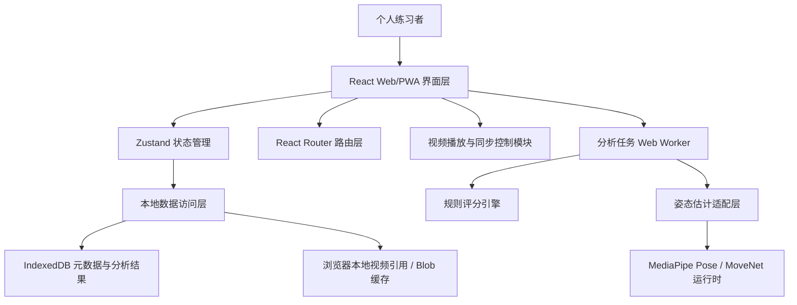
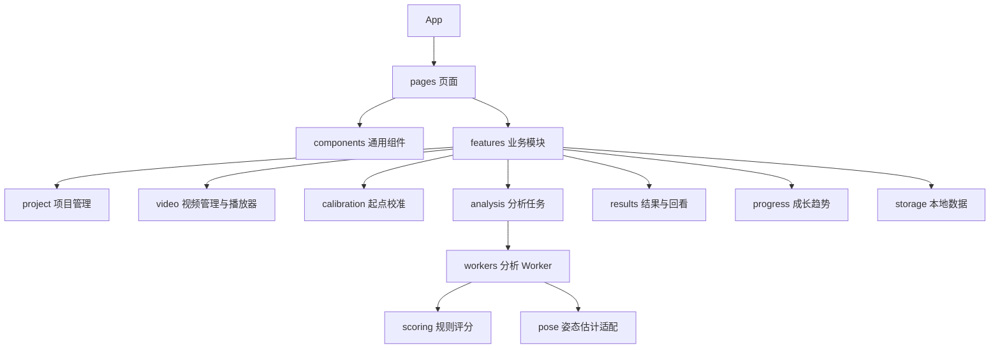
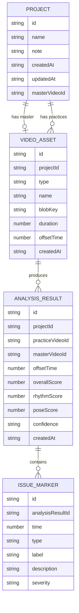

## 1. 架构设计



DanceTrace V1.0 采用纯前端 Web/PWA 架构，优先保障本地视频导入、手动起点校准、双播放器回看、基础姿态估计和本地成长记录。第一阶段不引入后端服务，不把云端同步作为必要能力。

## 2. 技术说明
- 前端：React@18 + TypeScript + Vite
- 样式：Tailwind CSS@3 + CSS Modules 或全局设计变量
- 路由：React Router
- 状态管理：Zustand
- 图表：Recharts 或 ECharts，优先选择轻量可维护方案
- 本地数据：IndexedDB，建议使用 Dexie 封装
- 姿态估计：优先接入 MediaPipe Pose；如浏览器兼容或性能不满足，再评估 MoveNet / TensorFlow.js
- 后台分析：Web Worker，避免视频帧处理阻塞主线程
- PWA：vite-plugin-pwa
- 测试：Vitest + React Testing Library，优先覆盖评分引擎、数据模型和关键 UI 状态

## 3. 路由定义
| 路由 | 用途 |
|------|------|
| `/` | 项目工作台，展示项目列表和创建入口 |
| `/projects/new` | 新建舞蹈项目 |
| `/projects/:projectId` | 项目详情，管理 Master 与 Practice 视频 |
| `/projects/:projectId/practice/:practiceId/player` | 基础练习播放器 |
| `/projects/:projectId/practice/:practiceId/calibrate` | 手动起点校准 |
| `/projects/:projectId/practice/:practiceId/analyze` | 分析任务状态与进度 |
| `/projects/:projectId/practice/:practiceId/results` | 单次分析结果 |
| `/projects/:projectId/practice/:practiceId/review` | 问题时间点双播放器同步回看 |
| `/projects/:projectId/progress` | 多版本成长趋势 |

## 4. API 定义
V1.0 无远程后端 API。前端内部采用服务接口隔离业务逻辑，便于后续替换为云端服务。

```ts
export interface Project {
  id: string;
  name: string;
  note?: string;
  createdAt: string;
  updatedAt: string;
  masterVideoId?: string;
}

export interface VideoAsset {
  id: string;
  projectId: string;
  type: 'master' | 'practice';
  name: string;
  objectUrl?: string;
  blobKey?: string;
  duration?: number;
  createdAt: string;
}

export interface PracticeVideo extends VideoAsset {
  type: 'practice';
  offsetTime?: number;
  latestAnalysisId?: string;
}

export interface PoseKeypoint {
  name: string;
  x: number;
  y: number;
  score?: number;
}

export interface PoseFrame {
  time: number;
  keypoints: PoseKeypoint[];
}

export interface IssueMarker {
  id: string;
  time: number;
  type: 'rhythm' | 'pose' | 'confidence';
  label: string;
  description: string;
  severity: 'low' | 'medium' | 'high';
}

export interface AnalysisResult {
  id: string;
  projectId: string;
  practiceVideoId: string;
  masterVideoId: string;
  offsetTime: number;
  overallScore: number;
  rhythmScore: number;
  poseScore: number;
  confidence: 'high' | 'medium' | 'low';
  confidenceNotes: string[];
  issueMarkers: IssueMarker[];
  createdAt: string;
}
```

## 5. 前端模块结构



建议目录：

```text
src/
  app/
  pages/
  components/
  features/
    project/
    video/
    calibration/
    analysis/
    results/
    progress/
    storage/
  workers/
  lib/
  styles/
```

## 6. 数据模型

### 6.1 数据模型定义



### 6.2 IndexedDB 表结构

```ts
db.version(1).stores({
  projects: 'id, name, createdAt, updatedAt',
  videoAssets: 'id, projectId, type, createdAt',
  analysisResults: 'id, projectId, practiceVideoId, masterVideoId, createdAt',
  issueMarkers: 'id, analysisResultId, time, type, severity',
  blobs: 'key'
});
```

## 7. 分析链路
1. 用户完成 Master 与 Practice 视频导入。
2. 用户在校准页设置 Master 起点与 Practice 起点，系统保存 `offsetTime`。
3. Web Worker 按固定采样间隔读取两个视频帧。
4. 姿态估计适配层输出 2D 关键点序列。
5. 评分引擎先做躯干尺度归一化，再计算关节角度、方向向量和相对结构偏差。
6. 节奏分关注关键动作节点时间偏移；动作分关注姿态结构偏差。
7. 生成综合分、问题时间点、可信度提示，并写入 IndexedDB。

## 8. 关键工程约束
- 手动起点校准是 V1.0 主方案，自动对齐不作为首版交付前提。
- 姿态估计失败、人体不完整、多人入镜、光线不足等情况必须进入低可信度提示。
- 评分结果必须可解释，不能只展示综合分。
- 视频和分析结果优先本地存储，用户清理浏览器数据可能导致数据丢失，需要在 UI 中提示。
- 分析任务必须放在 Worker 中，避免主线程卡顿。
- 首版控制视频时长与采样频率，避免浏览器性能不可控。
