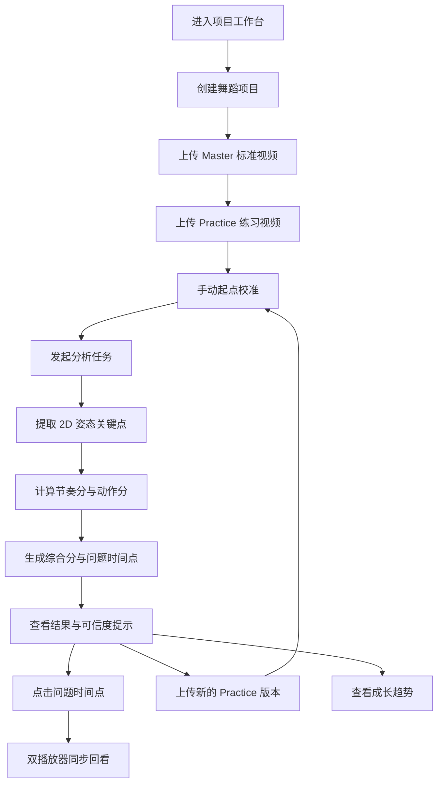

## 1. 产品概述
DanceTrace Web/PWA V1.0 是面向个人舞蹈自学场景的练习分析与成长记录工具，帮助用户围绕同一支舞导入 Master 标准视频、上传多个 Practice 练习版本，并获得可解释的练习反馈。
- 核心目的：回答“我这次跳得怎么样”“我主要错在哪里”“我多次练习后有没有进步”。
- 产品价值：用项目制管理、双播放器回看、基础姿态分析和成长曲线，降低个人舞蹈复盘成本。

## 2. 核心功能

### 2.1 用户角色
| 角色 | 使用方式 | 核心权限 |
|------|----------|----------|
| 个人练习者 | 本地 Web/PWA 使用，无强制登录 | 创建项目、导入视频、发起分析、查看结果、管理本地记录 |

### 2.2 功能模块
1. **项目工作台**：项目列表、项目创建、项目删除、项目进度概览。
2. **项目详情页**：Master 视频管理、Practice 版本管理、分析入口、历史分析状态。
3. **练习播放器页**：Master 视频播放、倍速播放、镜像播放、基础跟练。
4. **起点校准页**：手动校准 Master 与 Practice 的起始时间点，作为 V1.0 稳定分析入口。
5. **分析结果页**：综合分、节奏分、动作分、问题时间点、问题标签、可信度提示。
6. **双播放器回看页**：点击问题时间点后同步播放 Master 与 Practice，用于局部复盘。
7. **成长趋势页**：展示同一项目下多个 Practice 版本的综合分、节奏分、动作分变化。

### 2.3 页面详情
| 页面名称 | 模块名称 | 功能描述 |
|----------|----------|----------|
| 项目工作台 | 项目列表 | 展示所有本地项目、最近练习时间、练习版本数量和最新分数 |
| 项目工作台 | 新建项目 | 输入舞蹈名称、可选备注，创建本地 Project |
| 项目详情页 | Master 视频管理 | 上传或替换当前项目唯一 Master 标准视频 |
| 项目详情页 | Practice 版本管理 | 上传多个练习版本，展示上传时间、分析状态和分数 |
| 练习播放器页 | 基础播放 | 支持播放、暂停、进度拖动、倍速和镜像 |
| 起点校准页 | 手动校准 | 设置 Master 起点与 Practice 起点，保存 offset_time |
| 分析结果页 | 分数面板 | 展示综合分、节奏分、动作分，避免只用总分解释结果 |
| 分析结果页 | 问题时间点 | 展示关键问题时间、问题标签、简要说明，支持跳转回看 |
| 双播放器回看页 | 同步对比 | 按校准 offset 同步播放两个视频，支持跳转到问题附近 |
| 成长趋势页 | 趋势图 | 展示多次练习版本的分数变化和练习记录 |
| 全局 | 可信度提示 | 对遮挡、多人、光线不足、对齐偏移等情况给出风险提示 |

## 3. 核心流程
用户创建一个舞蹈项目，上传 Master 标准视频，再上传自己的 Practice 练习视频。系统要求用户先完成手动起点校准，然后执行姿态估计与规则评分，输出分数、问题时间点和可信度提示。用户可以点击问题时间点进入双播放器同步回看，并在后续上传更多练习版本后查看成长曲线。

## 4. 用户界面设计

### 4.1 设计风格
- 主色：深墨黑 `#0E1116`，用于形成专注、专业的练习工作台氛围。
- 辅色：电光青 `#20E0C4` 与节拍橙 `#FF9D42`，分别表达动作轨迹与节奏反馈。
- 按钮：大圆角、清晰状态反馈，主操作使用高对比填充按钮，次操作使用描边或幽灵按钮。
- 字体：标题使用有力量感的几何无衬线风格，正文使用高可读中文字体栈。
- 布局：桌面优先，采用左侧项目导航 + 中央视频/分析主区 + 右侧结果面板的工作台式布局。
- 图标：使用线性图标和少量动态节拍点，避免娱乐化过强，强调“练习、复盘、成长”。
- 动效：页面进入采用轻量渐显；分数卡片、问题时间点、同步播放状态使用细腻过渡，不做喧宾夺主的动画。

### 4.2 页面设计概览
| 页面名称 | 模块名称 | UI 元素 |
|----------|----------|---------|
| 项目工作台 | 项目列表 | 深色卡片、分数徽章、版本数量、最近练习时间、空状态引导 |
| 项目详情页 | 视频管理 | Master 大卡片、Practice 版本时间线、分析状态标签 |
| 练习播放器页 | 播放器 | 视频画面、倍速选择、镜像开关、当前时间轴 |
| 起点校准页 | 校准面板 | 双视频预览、起点标记按钮、offset 数值、重新校准按钮 |
| 分析结果页 | 分数面板 | 三个分数环、问题列表、可信度提示条 |
| 双播放器回看页 | 对比复盘 | 左右双播放器、同步锁定状态、问题时间点跳转列表 |
| 成长趋势页 | 趋势图 | 折线图、版本卡片、关键分数变化说明 |

### 4.3 响应式设计
- 桌面优先：优先保证双播放器、分析面板、趋势图在宽屏上可用。
- 平板适配：双播放器可上下堆叠，结果面板折叠为底部抽屉。
- 移动适配：PWA 可运行，但 V1.0 移动端以查看和轻量操作为主，复杂视频分析优先建议桌面端完成。

### 4.4 PWA 指导
- 支持安装到桌面，提供应用图标、启动页和离线可访问壳。
- 本地视频和分析结果优先存储在浏览器本地，不默认上传云端。
- 明确提示浏览器本地存储风险，避免用户误以为数据已云端备份。
